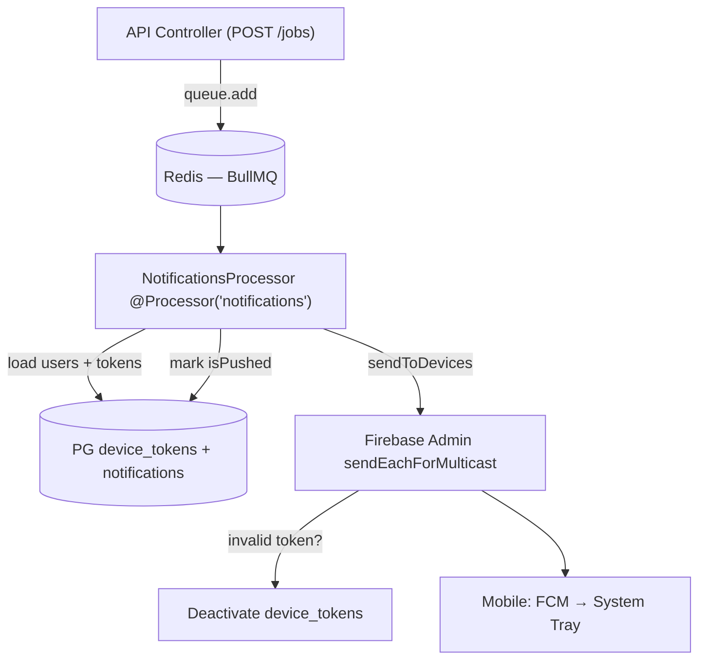

# Notification System — Framework & Design (per Brief §12)

> Events: New job, Application update, Project assignment, Site assignment, Attendance, Daily report submitted, Project update, Admin announcement
> Stack: Firebase FCM (already `firebase.provider.ts:14`) + Redis + BullMQ (`ioredis@6`, `bullmq@6` already in `package.json`) + `notifications` + `device_tokens`

## Framework

```
NestJS Event → BullMQ Queue (Redis) → Processor → Firebase Admin → FCM → Device
    (api)        (async, retry)        (fan-out)     (multicast)      (app)
```

- **Queue:** `BullModule.forRoot({connection: REDIS_URL})` + `BullModule.registerQueue({name:'notifications'})`
- **Why queue?** §12 fan-out 1,000 seekers on `POST /jobs` would block 5s. Queue returns `201` instantly, worker sends offline.
- **Store:** `notifications` (id, userId, title, body, type, data jsonb, isPushed, isRead) + `device_tokens` (userId, fcmToken unique, platform, isActive)

## Flow per §12 table

| Event | Trigger in code | Recipients | Bull Job |
|---|---|---|---|
| New job | `jobs.service.create → queue.add('newJob',{jobId, companyId})` | Relevant Seekers (skill/location) | `newJob` |
| Application update | `applications.updateStatus → queue.add('appUpdate',{applicationId})` | Seeker + Company | `appUpdate` |
| Project assignment | `projects.create → queue.add('projectAssign',{projectId})` | Contractor | `projectAssign` |
| Site assignment | `project-sites.assignEngineer → queue.add('siteAssign',{siteId, engineerId})` | Site Engineer | `siteAssign` |
| Attendance | `attendance.checkIn → queue.add('attendance',{siteId})` | Contractor/Admin | `attendance` |
| Daily report submitted | `reports.createDailyReport → queue.add('dailyReport',{reportId})` | Contractor/Admin | `dailyReport` |
| Project update | `projects.update → queue.add('projectUpdate')` | Project users | `projectUpdate` |
| Admin announcement | `notifications.controller POST /notifications/announcement` | audience filter | `announcement` |

## Architecture



- **Processor** `src/modules/notifications/notifications.processor.ts`:
  ```ts
  @Processor('notifications')
  export class NotificationsProcessor extends WorkerHost {
    @Process('newJob') handleNewJob(job) { /* load seekers, create notifications rows batch, get tokens, sendToDevices */ }
    @OnQueueFailed retry 3x with backoff
  }
  ```
- **Provider** already `firebase.provider.ts:106 sendToDevices()` handles multicast + `invalid-registration-token` cleanup `notifications.service.ts:132`.

## API

| Method | Path | Who |
|---|---|---|
| `POST /notifications/device-token` | Register ` {fcmToken, platform}` | all |
| `DELETE /notifications/device-token` | Logout → deactivate | all |
| `GET /notifications?page&isRead` | List own + `unreadCount` | own |
| `PATCH /notifications/:id/read` | Mark one read | own |
| `POST /notifications/read-all` | Mark all read | own |
| `POST /notifications/announcement` | Admin broadcast `{title,body,audience}` | admin |

## Data

- `device_tokens: id, userId→users.id, fcmToken unique, platform (android/ios/web), isActive, lastUsedAt`
- `notifications: id, userId, title, body, type (job|application|site|report), data jsonb {jobId,siteId}, isPushed, isRead, createdAt`

## Setup (later, not now)

```bash
# .env already REDIS_URL=redis://localhost:6379
# Docker later per §17
docker run -d -p 6379:6379 redis:7
# Nest: app.module.ts → BullModule.forRoot({connection: {url: process.env.REDIS_URL}}) + BullModule.registerQueue({name:'notifications'})
```

> Keep `POST /notifications/device-token` working now (already), queue wiring is next without changing controllers — just move `sendToDevices` from request thread to processor.
