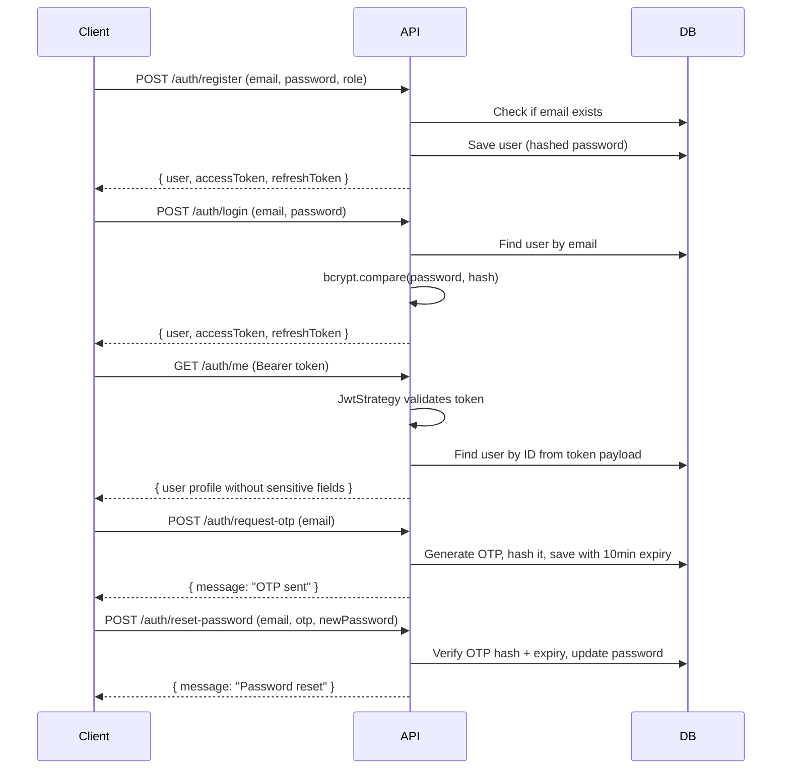

# Auth Module

## Overview
Handles all authentication flows: registration, login, OTP-based password reset, JWT token management, and session refresh.

## File Structure
```
src/modules/auth/
├── auth.controller.ts        # Route definitions for /api/v1/auth/*
├── auth.module.ts            # Module registration (JWT, Passport, TypeORM)
├── auth.service.ts           # Core auth business logic
├── strategies/
│   └── jwt.strategy.ts       # Passport JWT validation strategy
├── dto/
│   ├── register-user.dto.ts  # Validation for registration
│   ├── login-user.dto.ts     # Validation for login
│   ├── request-otp.dto.ts    # Validation for OTP request
│   ├── reset-password.dto.ts # Validation for password reset
│   └── refresh-token.dto.ts  # Validation for token refresh
└── tests/
    └── auth.spec.ts          # Unit tests
```

## API Endpoints

| Method | Route                            | Auth | Description                          |
|--------|----------------------------------|------|--------------------------------------|
| POST   | `/api/v1/auth/register`          | No   | Register a new user                  |
| POST   | `/api/v1/auth/login`             | No   | Login and receive tokens             |
| GET    | `/api/v1/auth/me`                | JWT  | Get current authenticated user       |
| POST   | `/api/v1/auth/request-otp`       | No   | Request a 6-digit OTP via email      |
| POST   | `/api/v1/auth/reset-password`    | No   | Reset password using OTP             |
| POST   | `/api/v1/auth/users/:userId/refresh` | No | Refresh expired access token     |

## Auth Flow



## Key Design Decisions
- **Password Hashing**: bcryptjs with 10 salt rounds.
- **Access Token**: JWT signed with `JWT_SECRET`, expires in 15 minutes.
- **Refresh Token**: Random 40-byte hex string, hashed with bcrypt before storing in DB.
- **OTP**: 6-digit numeric code, hashed with bcrypt, expires in 10 minutes.
- **Sensitive Field Scrubbing**: `passwordHash`, `otpHash`, and `refreshTokenHash` are stripped from all API responses via the `JwtStrategy`.
