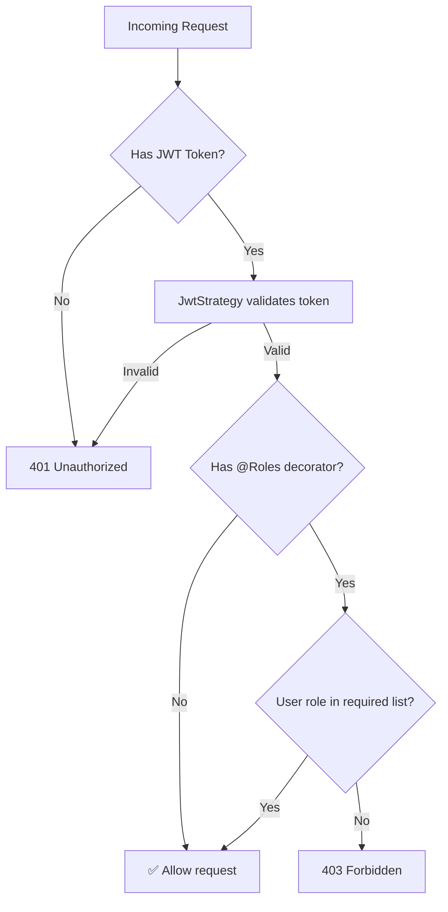

# Authorization Module

## Overview
Implements Role-Based Access Control (RBAC) for the entire platform. Provides reusable decorators and guards that enforce the Permission Matrix from the Technical Brief.

## File Structure
```
src/modules/authorization/
├── authorization.controller.ts   # Empty (no public endpoints)
├── authorization.module.ts       # Module registration, exports AuthorizationService
├── authorization.service.ts      # Ownership/isolation logic (Site Engineer → assigned site only)
└── tests/
    └── authorization.spec.ts     # Unit tests

src/common/decorators/
├── roles.decorator.ts            # @Roles('admin', 'contractor') decorator
└── current-user.decorator.ts     # @CurrentUser() parameter decorator

src/common/guards/
└── roles.guard.ts                # RolesGuard - enforces @Roles() on routes
```

## How to Protect an Endpoint

```typescript
import { UseGuards } from '@nestjs/common';
import { AuthGuard } from '@nestjs/passport';
import { RolesGuard } from '../../common/guards/roles.guard';
import { Roles } from '../../common/decorators/roles.decorator';
import { CurrentUser } from '../../common/decorators/current-user.decorator';

@Controller('projects')
@UseGuards(AuthGuard('jwt'), RolesGuard)  // 1. Require JWT + check roles
export class ProjectsController {

  @Post()
  @Roles('admin', 'contractor')            // 2. Only these roles allowed
  async createProject(
    @CurrentUser() user: User,              // 3. Get the authenticated user
    @Body() dto: CreateProjectDto,
  ) {
    return this.projectsService.create(user, dto);
  }
}
```

## Permission Matrix (from Technical Brief Section 10.1)

| Capability               | Admin | Contractor | Site Engineer  | Company | Job Seeker |
|---------------------------|-------|------------|----------------|---------|------------|
| Manage users              | ✅    | ❌         | ❌             | ❌      | ❌         |
| Create project            | ✅    | ✅         | ❌             | ❌      | ❌         |
| Create site               | ✅    | ✅         | ❌             | ❌      | ❌         |
| Enter daily site data     | ✅    | ✅         | ✅             | ❌      | ❌         |
| Submit daily report       | ✅    | ✅         | ✅             | ❌      | ❌         |
| View project profitability| ✅    | ✅         | Assigned only  | ❌      | ❌         |
| Create job                | ✅    | ❌         | ❌             | ✅      | ❌         |
| Apply for job             | ✅    | ❌         | ❌             | ❌      | ✅         |
| Manage calculators        | ✅    | ❌         | ❌             | ❌      | ❌         |

## Guard Execution Flow



## Key Design Decisions
- **Static Role Checks**: The `RolesGuard` handles simple role-based access.
- **Dynamic Isolation Checks**: The `AuthorizationService` contains skeleton methods (`assertSiteAccess`) for checking database-level ownership. These will be wired up when Projects/Sites modules are built.
- **No Entities**: Authorization doesn't need its own database tables. Roles are stored on the `User` entity.
